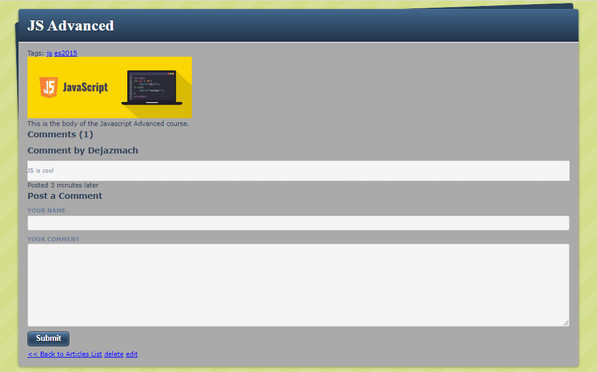

# Ruby Scraper
> This project is a simple blogging app created to practice the Ruby On Rails development process

## Demo

[Live Demo](https://blooming-brook-15385.herokuapp.com/)

## Built With
- Ruby On Rails
- Heroku
- PostgreSQL
- Rubocop
- Paperclip
- Image Magic

## Requirements
- The project enables CRUD oprations on Articles
- The project enables commenting on Articles
- The project enables adding tags for Articles
- The code should be linted

## Getting Started
- Clone the project in to your computer using `git clone https://github.com/DejazmachMolla/blogger.git` 
- `cd` into the `blogger` folder
- run `bundle install`
- run `rails s`
- Open your browser and go to `http://localhost:3000`

## Authors

:bust_in_silhouette: **Dejazmach Molla**

- Github: [@DejazmachMolla](https://github.com/DejazmachMolla)
- Twitter: [@DJATSS](https://twitter.com/DJATSS)
- Linkedin: [Dejazmach Molla](https://www.linkedin.com/in/dejazmach-getachew-027aabaa/)

## Show your support

Give a ⭐️ if you like this project!

## Acknowledgments

- Microverse
- Heroku